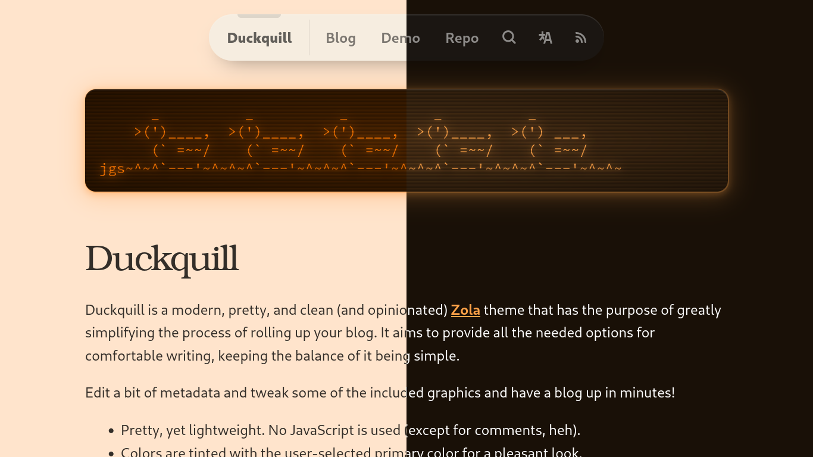

# Duckquill

[Duckquill](https://daudix.codeberg.page/duckquill) is a modern, pretty, and clean (and very opinionated) [Zola](https://www.getzola.org) theme that has the purpose of greatly simplifying the process of rolling up your blog. It aims to provide all the needed options for comfortable writing, keeping the balance of it being simple.

## Docs

See the [live demo](https://daudix.codeberg.page/duckquill) for the docs.

## Contribute

If you want to improve Duckquill in any way, feel free to open an issue, or better yet, a pull request! I appreciate every contribution!

## Credits

- [Quill image used in the metadata card](https://commons.wikimedia.org/wiki/File:3quills.jpg)

## Thanks to ♥

- [Jakub Steiner](https://jimmac.eu) for the [OS Component Website](https://jimmac.github.io/os-component-website), on top of which this whole thing is built
- [Carl Schwan](https://carlschwan.eu) for the [Mastodon-powered Comments](https://carlschwan.eu/2020/12/29/adding-comments-to-your-static-blog-with-mastodon/)
- Everyone who supported me and said good stuff <3
